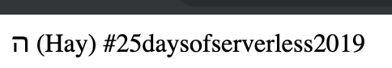

# Challenge:
Your task for today: create a REST API endpoint that spins a dreidel and randomly returns נ (Nun), ג (Gimmel), ה (Hay), or ש (Shin). This sounds like a great opportunity to use a serverless function to create an endpoint that any application can call!

Solution to Day 1 of the #25DaysOfServerless. This solution use a GCP Cloud Function.

Pretty straightforward one! Just uploaded the logic on this repo, changed 'functions to execute to main', and set the trigger to HTTP.

Preview:
